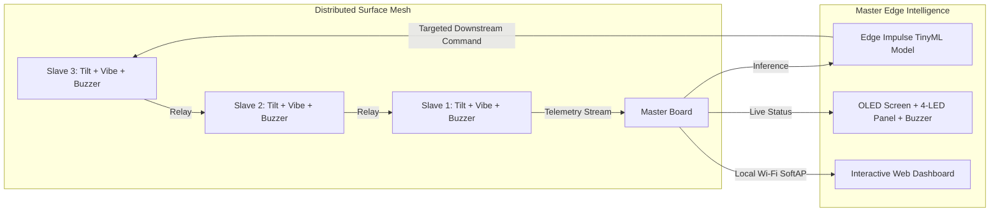

# Smart India Hackathon 2026 
#### Internal Hackathon @ Amrita Vishwa Vidyapeetham, Coimbatore Campus - Organized by Institution's Innovation Council (IIC)

  

## SIH26-A0H-T226 - Team ForgeByte  

### PS#1 Details

* **Problem Statement ID:** SIH26025
* **Problem Statement Title:** Development of an AI-enabled Low Cost Real Time Mine Subsidence Monitoring, Prediction and Early Warning System for Underground Coal Mines in India
* **Theme / Category:** Smart Automation / Hardware
* **Ministry / Organization:** Ministry of Coal / Coal India Limited

---

### Background

Surface subsidence caused by underground coal mining poses significant risks to nearby communities, public infrastructure, agricultural land, forest areas, and the surrounding environment. In India, subsidence monitoring is still largely dependent on conventional field observations, periodic surveys, and post facto damage assessments, which often fail to provide timely warning before critical ground failure occurs.

There is a strong need for an indigenous, low cost, intelligent, and real time monitoring solution capable of detecting early signs of ground movement and enabling proactive risk mitigation. Such a system should be affordable, scalable, and deployable across Indian underground coal mines using widely accessible technologies, thereby supporting the national vision of smart and sustainable mining.

---

### Description

The problem envisages development of an AI-enabled smart mine subsidence monitoring and early warning platform based on a localized wireless surface mesh sensor network deployed above underground mine panels.

The proposed solution involves installing a distributed network of low cost smart sensor nodes across the surface over the underground mining area. Each node may be equipped with sensors such as:

* Tilt / inclination sensors
* Vibration sensors
* Displacement / stretch sensors
* Crack detection sensors
* Optional low cost positioning modules

These nodes will communicate through a wireless mesh communication network (such as LoRa / Zigbee / Wi-Fi mesh), enabling continuous real time monitoring of micro ground movements over the mine panel.

The system should continuously detect:

* Abnormal ground tilt
* Change in relative distance between nodes
* Early crack initiation
* Unusual vibration signatures, which may indicate the onset of subsidence

Using Artificial Intelligence / Machine Learning, the platform should:

* Identify abnormal deformation patterns
* Predict possible subsidence zones
* Estimate severity and progression
* Generate automated early warning alerts
* Support timely operational decisions

The solution should be robust, low power, scalable, and suitable for Indian geo-mining conditions.

---

### Expected Solution

A web/mobile enabled intelligent mine subsidence monitoring platform integrating IoT, wireless mesh networking, AI, and GIS technologies for:

* Development of low cost smart sensor nodes using readily available hardware platforms (e.g., Arduino / ESP32 / Raspberry Pi)
* Deployment of a localized wireless mesh network over underground mine panels for continuous surface deformation sensing
* Real time monitoring of tilt, displacement, vibration, and crack initiation
* AI/ML-based anomaly detection and subsidence prediction using live and historical data
* GIS based visualization of live deformation maps and risk zones
* Automated early warning alerts through SMS / email / mobile app notifications
* Interactive dashboards for mine operators, planners, and regulators
* Offline capability with periodic cloud synchronization
* Scalable deployment across multiple underground coalfields

The proposed solution must be low cost, easy to deploy, energy efficient, scalable, and student prototype friendly, while enabling a *Made in India* smart mining safety solution for sustainable underground coal mining.

---

### Key Innovation Hook

> **Wireless Surface Mesh Network for Real Time Subsidence Detection** — Differentiates the system from generic AI proposals through localized, low-power, distributed physical sensing and mesh telemetry.

---

## 🚀 Team ForgeByte System Architecture & Implementation

### 1. Hardware Architecture & Topology
* **Slave Nodes (Distributed Field Units):**
  * **Dual Sensor Array:** MPU6050 (6-axis Tilt / Inclinometer) + SW-420 (Micro-seismic Vibration Sensor). *(Modular design ready for Soil Moisture & Crack Gauges in production).*
  * **Multi-Hop Relay:** Uses wireless mesh / daisy-chain protocol (`Slave N` $\rightarrow$ `Slave N-1` $\dots$ $\rightarrow$ `Master Node`).
  * **Onboard Local Siren:** Integrated buzzer and strobe LED for targeted danger-zone evacuation.
* **Master Node (Central Edge AI Hub):**
  * **Edge AI Engine:** Embedded **Edge Impulse TinyML** classification model running real-time inference.
  * **Local Display & Physical Alert Interface:** 0.96" I2C OLED display, 4-tier LED status indicators (🟢 Normal, 🟡 Watch, 🟠 Warning, 🔴 Critical), and high-decibel master buzzer.
  * **Offline Web Server & SoftAP:** Hosts an interactive local web dashboard over self-broadcasted Wi-Fi (`192.168.4.1`) requiring zero external internet or cloud dependencies.

---

### 2. Core Implemented Features

| # | Feature | Description & Impact |
| :-: | :--- | :--- |
| **1** | **Targeted Zone Siren & Evacuation** | Master sends downstream command to trigger the buzzer **specifically on the endangered slave node** (e.g., Node 13) to alert nearby field workers without mass panic. |
| **2** | **"All-Call" Mass Evacuation Mode** | A panic trigger on the Master web dashboard to sound alarms across all slave nodes simultaneously during large-scale subsidence events. |
| **3** | **Self-Healing Mesh & Node Heartbeat** | Automatic node health pings; if a node is lost or destroyed by shifting strata, packets reroute and the Master OLED flags the damaged node. |
| **4** | **Heavy Vehicle vs Subsidence FFT Filter** | Edge Impulse spectral analysis filters out transient vibrations from mining dumpers/traffic, avoiding false alarms. |
| **5** | **Rate-of-Change Velocity Index ($\Delta\theta/\Delta t$)** | Detects acceleration of surface ground tilt over time windows rather than relying on static angle thresholds. |
| **6** | **100% Offline Local Wi-Fi Dashboard** | Operators connect directly to Master's Wi-Fi hotspot to view interactive 2D grid maps, node telemetry, and real-time live charts. |
| **7** | **Solar-Ready Ultra-Low Power Management** | Deep sleep cycles ensure field slave nodes operate for months on small Li-ion cells + solar harvesting. |
